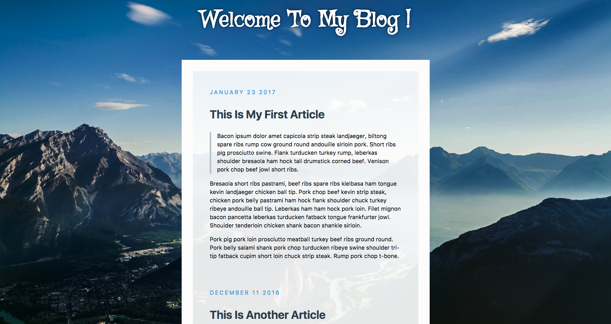
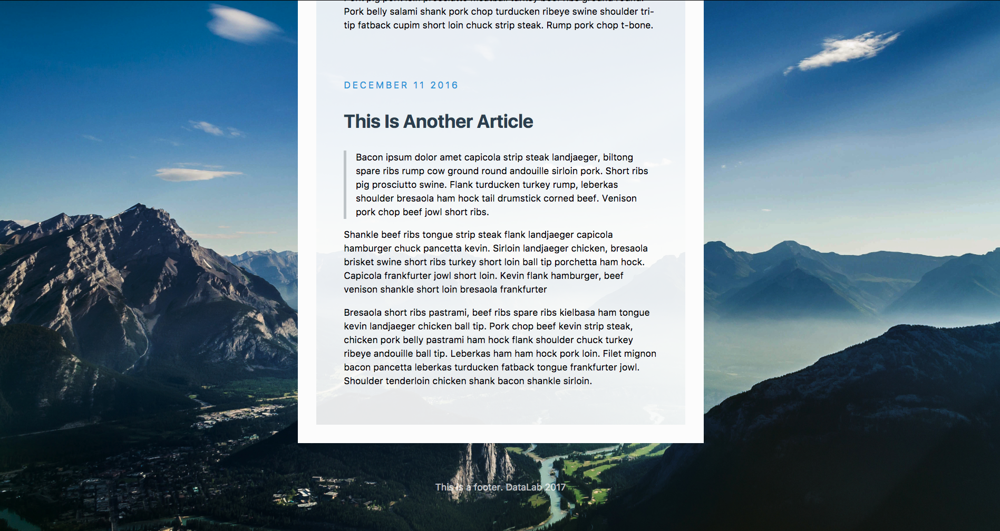
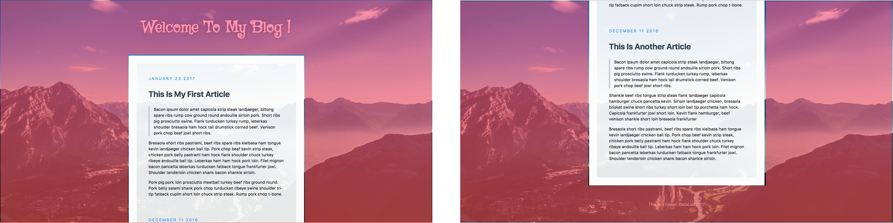
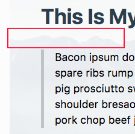
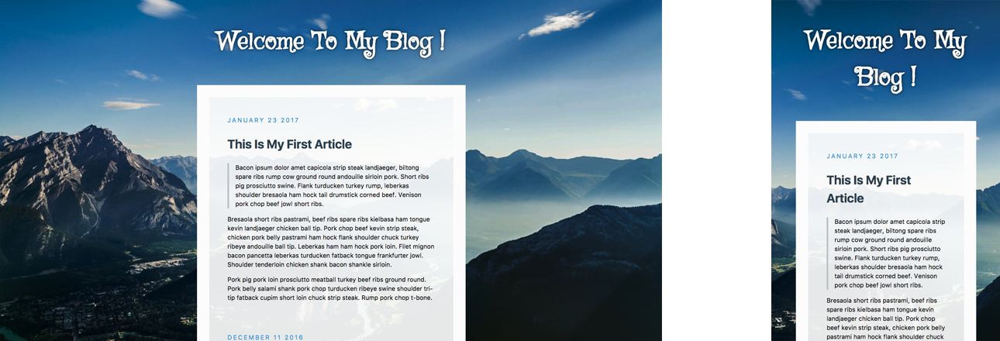
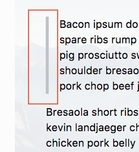
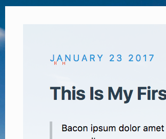
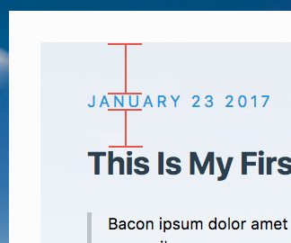

# Quiz 1 - My First Blog
  
 

## Grading

#### NOTE. Your blog page need not to be exactly the same with the example.

0. Html Title (5%)

1. Fixed centered covered Background (15%) 
  * The background image(red part) doesn't scroll along with the content.  

2. Foreground  
  * (1) Transparent foreground (10%) 
  Your article should be able to see the background image  
   
  * (2) Max-width and responsive width (20%) 
The content of the webpage should be responsive according to the window width  
  

3. Custom Header Font (5%) 
  *   

4. Article   
  * (1) Quote (10%) 
  The quote should indent with a grey line  
     
  * (2) Custom text decorations for dates and article (10%) 
  (e.g. the space between date letters, and "auto" uppercase for dates, bold title, etc.)  
     
  * (3) Spacing for the dates (5%) 
     

5. Text shadow in header and footer (10%) 
  *   

6. Rem-based sizing 
  * Increasing font size also increases spaces (10%) 

## Submission
Open a new merge request when you finished your quiz.  
We'll accept all merge requests so that you can open new request after the lab. 
**DEADLINE**: 2018/03/08 23:59

## Git Workflow
#### NOTE :   
Make sure you are in the project folder.  
Make sure you have configured user.email and user.name for git.

1. Fork the project.
2. Clone `your` project .../{your id}/lab-css-blog-quiz.git into your computer.
3. Do the quiz.
4. Submit your code to gitlab.  
  * Step 1. Tell git to track all files in the project  
  git add . or git add -A
  * Step 2. Commit your changes  
  git commit -m "Finish quiz 1"
  * Step 3. Push to gitlab.  
  git push
5. Open merge request
  * Source branch: master branch in `your project`
  * Target branch: `Your ID`
  * `Title` : std{your ID} Submission
  * If you open merge request after lab hours, append "late" to your title  
  e.g. std105062558 Submission late

Q: How to check if I have submitted my code to gitlab successfully?  
A: Clone our MAIN project, checkout your branch, and see your changes.  
git clone https://shwu10.cs.nthu.edu.tw/courses-software-studio-2017-spring/lab-css-blog-quiz.git  
git checkout {your ID} (e.g. git checkout 105062558)  

## `IMPORTANT` 
From now on, we will not help you to deal with any git problems during the quiz. 
If there's nothing in your branch, you will get 0 points.
